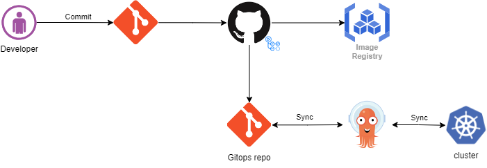

# Testing ArgoCd with app-of-apps pattern



# Setup up argo locally

Installng the argocd cli

```bash
brew install argocd
```

Running argo on docker-desktop cluster

```bash
./install.sh # setup argo on your kubernetes cluster

#wait till agro is running correctly
./port.sh # setup ports to connect to argo

./connect.sh # connect to argo change password and connect test-repo
```

## patterns/architectures

- app-of-apps (this
  demo): https://www.cncf.io/blog/2025/10/07/managing-kubernetes-workloads-using-the-app-of-apps-pattern-in-argocd-2/?utm_source=copilot.com
-  argocd agent: https://github.com/argoproj-labs/argocd-agent

More information about different architectures: 
- https://akuity.io/blog/argo-cd-architectures-explained

## debugging

Stuck interface on deleting resource in argo:

```bash
kubectl patch Application/{resource} \
>     --type json \
>     --patch='[ { "op": "remove", "path": "/metadata/finalizers" } ]'
```

sync application

```bash
argocd app sync argocd/test-infra-app-of-apps
```